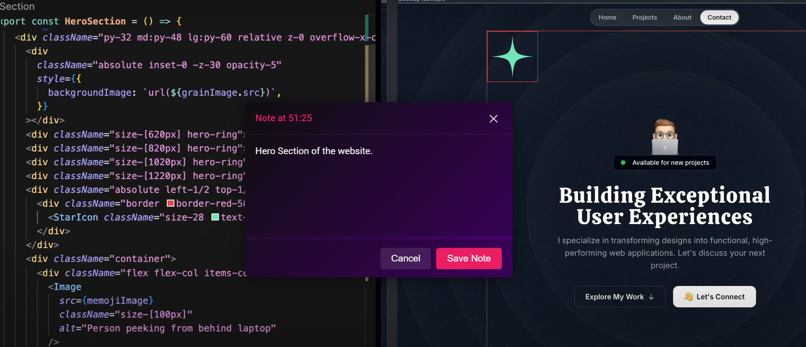
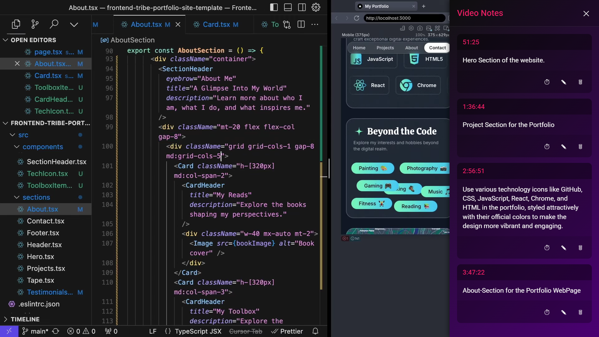
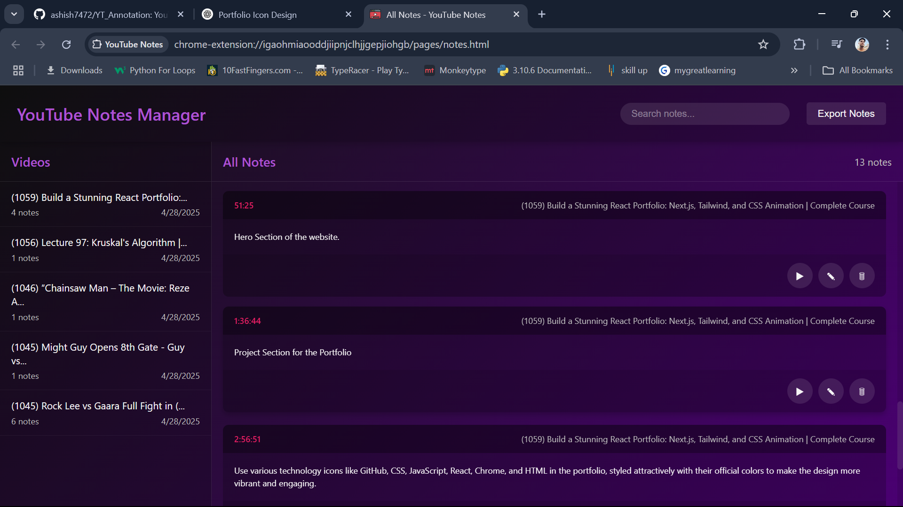

# YouTube Notes Extension

## About
The YouTube Notes Extension is a powerful Chrome extension that allows you to add personal notes to YouTube videos at specific timestamps. Whether you're studying, reviewing tutorials, or saving key moments, this extension helps you organize your thoughts effortlessly.

## Features
- Add notes with timestamps to any YouTube video.
- Edit or delete notes as needed.
- Sync notes across tabs for the same video.
- Notes can be downloaded in json file for storage purpose.
- Simple and intuitive user interface.

## Installation
1. Clone or download this repository.
2. Open Chrome and go to `chrome://extensions/`.
3. Enable "Developer mode" in the top right corner.
4. Click "Load unpacked" and select the extension folder.

## Screenshots

## Usage
> While watching a YouTube video, click the extension icon to open the popup. Use the interface to add, edit, or delete notes. Notes are automatically saved and synced with the video's page. And you can also export or download all the notes in json file.

## Contributing
Contributions are welcome! Please fork this repository and submit a pull request with your changes. For major changes, please open an issue first to discuss.

## License
This project is licensed under the MIT License.

---

Developed with ❤️ by [Ashish Rolan] | Last updated: April 28, 2025